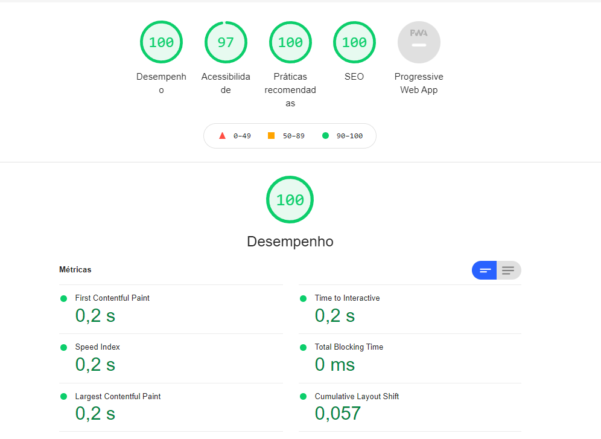

<h1 align="center" class="line-1 anim-typewriter">Suite-Landing-Page</h1>

<h2>Preview</h2>

 

<h2>Acessibilidade</h2>

    <a href="#the_challenge">O desafio</a> |
     <a href="#links">Links</a> |
      <a href="#built_with">Ferramentas usadas</a> |
       <a href="#resources">Recursos</a>

<h2 id="the_challenge"> 🌋 O desafio</h2>

Esta é a solução do desafio proposto por [Frontend Mentor](https://www.frontendmentor.io).

Criar uma pagina web usando o figma com base:

- [x] Veja o layout ideal dependendo do tamanho da tela do dispositivo
- [x] Veja os estados de foco para elementos interativos

<h2 id="links">🔗 Links</h2>

- live: https://suite-landing-page.vercel.app/#
- SpeadCode video: ??
- Frontend Mentor Solution: 

<h2 id="built_with">👷‍♂️ Ferramentas utilizadas</h2>

-   HTML5;
-   SCSS;
-  [Progressive-Size](https://www.npmjs.com/package/progressive-size)

<h2 id="author">👨‍🎓 Autor </h2>

- Nome: Marlon Felipe dos Passos
- linkedin: https://www.linkedin.com/in/marlon-passos-8a38061a8/
